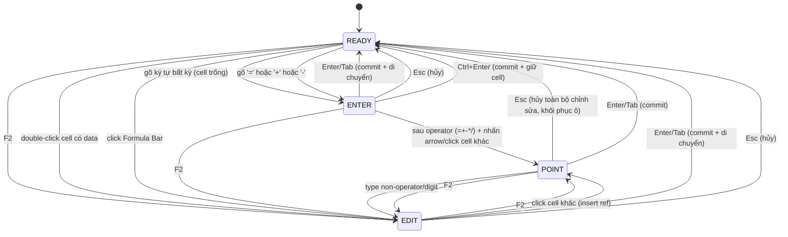
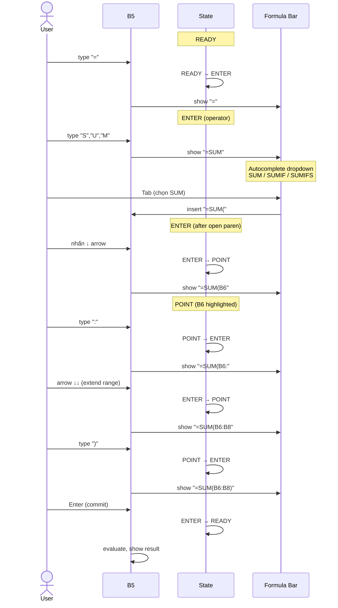

# UX Flow — Spec 03 Cell Modes (Ready / Enter / Edit / Point)

> Spec gốc: [../03-cell-modes.md](../03-cell-modes.md)

## State machine



## ASCII mockup từng state

### READY mode
```
┌─────────────────────────────────────────┐
│ Name Box: [B5    ▼]  fx [(empty)____]  │  Status Bar: ┌─────────┐
│ ┌───┬───┬───┬───┬───┬───┐                            │  Ready  │
│ │ A │ B │ C │ D │ E │ F │                            └─────────┘
│ 5 │   │▓██│   │   │   │   │  ← B5 active, viền xanh dày 2px
│ 6 │   │   │   │   │   │   │
└───┴───┴───┴───┴───┴───┴───┘
```

### ENTER mode (vừa gõ "5")
```
┌─────────────────────────────────────────┐
│ Name Box: [B5    ]  fx [5_]  ✓ ✗       │  Status Bar: ┌─────────┐
│ ┌───┬───┬───┬───┬───┬───┐                            │  Enter  │
│ 5 │   │5| │   │   │   │   │  ← cursor nhấp nháy      └─────────┘
└───┴───┴───┴───┴───┴───┴───┘
```

### EDIT mode (F2 trên cell có formula =SUM(A1:A3))
```
┌─────────────────────────────────────────┐
│ Name Box: [B5    ]  fx [=SUM(A1:A3)|]  │  Status Bar: ┌─────────┐
│  ┌───┬───┬───┬───┬───┬───┐                            │  Edit   │
│  │ A │ B │ C │ D │ E │ F │                            └─────────┘
│ 1│▓▓▓│   │   │   │   │   │  ← A1:A3 highlight (xanh nét đứt)
│ 2│▓▓▓│   │   │   │   │   │  ← reference colors  
│ 3│▓▓▓│   │   │   │   │   │
│ 5│   │=SUM(A1:A3)|         │  ← formula trong cell, cursor nhấp nháy
└──┴───┴───┴───┴───┴───┴───┘
```

### POINT mode (Edit mode + click A1 hoặc Enter mode + arrow sau "=")
```
┌─────────────────────────────────────────┐
│ Name Box: [A1    ]  fx [=A1|_______]   │  Status Bar: ┌─────────┐
│  ┌───┬───┬───┬───┬───┬───┐                            │  Point  │
│  │ A │ B │ C │ D │ E │ F │                            └─────────┘
│ 1│▓██│   │   │   │   │   │  ← A1 viền chấm xanh (marching ants)
│ 5│   │=A1|                  │  ← formula đang nhập
└──┴───┴───┴───┴───┴───┴───┘
```

## Bảng keyboard behavior per mode

| Phím | READY | ENTER | EDIT | POINT |
|---|---|---|---|---|
| Arrow ↑↓←→ | move cell | commit + move | move cursor in text | extend/move ref |
| Enter | move down 1 | commit + down | commit + down | commit |
| Tab | move right | commit + right | commit + right | — |
| Esc | — | cancel → Ready | cancel → Ready | cancel → Ready (hủy cả edit, khôi phục ô) |
| F2 | → Edit | → Edit | → Point | → Edit |
| Backspace | clear cell | delete char | delete cursor char | — |
| Delete | clear cell | delete forward | delete forward | — |
| Home | A in row | start of text | start of cursor line | — |
| End | last data col | end of text | end of cursor line | — |
| Ctrl+Z | Undo | undo type | undo type | — |
| `=` `+` `-` | enter ENTER | adds operator | adds operator | exit POINT, continue formula |

## Sequence diagram — typing formula `=SUM(A1:A3)` step-by-step



## User journey — Esc behavior khi đang sửa công thức

> **Quan trọng:** Excel KHÔNG có bước "Esc hủy mỗi reference rồi giữ formula".
> Một lần Esc ở bất kỳ mode đang-sửa nào (Enter/Edit/Point) **hủy toàn bộ
> chỉnh sửa và khôi phục nội dung cũ của ô**. (Muốn xóa riêng phần ref vừa gõ
> thì dùng Backspace, không phải Esc.)

```mermaid
flowchart TD
    A[Cell B5 với =SUM(A1) đã có data] --> B[F2 vào EDIT]
    B --> C[F2 lần nữa vào POINT]
    C --> D[Click cell C3 - insert ref]
    D --> E[Formula bar: =SUM(A1)+C3]
    E --> F{Nhấn Esc}
    F -->|hủy toàn bộ chỉnh sửa| I["Quay về READY, khôi phục =SUM(A1) cũ"]

    style F fill:#fff3cd
    style I fill:#d4edda
```

## Edge cases visual

### Multi-cell selection + Ctrl+Enter
```
Step 1 — User select A1:B3 (6 cells):
┌───┬───┬───┐
│▓▓▓│▓▓▓│   │  ← active = A1 (white), 5 cells còn lại xanh nhạt
│▓▓▓│▓▓▓│   │
│▓▓▓│▓▓▓│   │

Step 2 — User type "hi":
┌───┬───┬───┐
│hi |   │   │  ← chỉ A1 hiện text
│   │   │   │
│   │   │   │

Step 3 — User press Ctrl+Enter:
┌───┬───┬───┐
│ hi│ hi│   │  ← TẤT CẢ 6 ô = "hi", selection giữ nguyên
│ hi│ hi│   │
│ hi│ hi│   │
```

### Circular reference visual
```
A1 = "=B1"
B1 = "=A1"  ← user vừa nhập

Popup dialog:
┌─ Microsoft Ezcel ────────────────────┐
│ ⚠ Circular Reference                  │
│                                       │
│ There are one or more circular        │
│ references where a formula refers     │
│ to its own cell either directly or    │
│ indirectly.                            │
│                                       │
│ Circular references: $B$1, $A$1       │
│                                       │
│              [ OK ]   [ Help ]         │
└───────────────────────────────────────┘

Status Bar (after dismiss):
┌─────────────────────────────────────────┐
│ Ready   |   Circular References: $A$1   │
└─────────────────────────────────────────┘
```

## Implementation hint cho Slave

- Bind state machine vào `MainWindow` (1 enum + 1 signal `mode_changed(CellMode)`).
- Hook `QTableView.keyPressEvent` + `QLineEdit.keyPressEvent` (Formula Bar) để intercept arrow keys khác behavior tùy mode.
- POINT mode: render reference highlight overlay trên cells (chấm xanh marching ants) — separate from selection.
- Status Bar label cập nhật ngay khi mode_changed signal emit.
