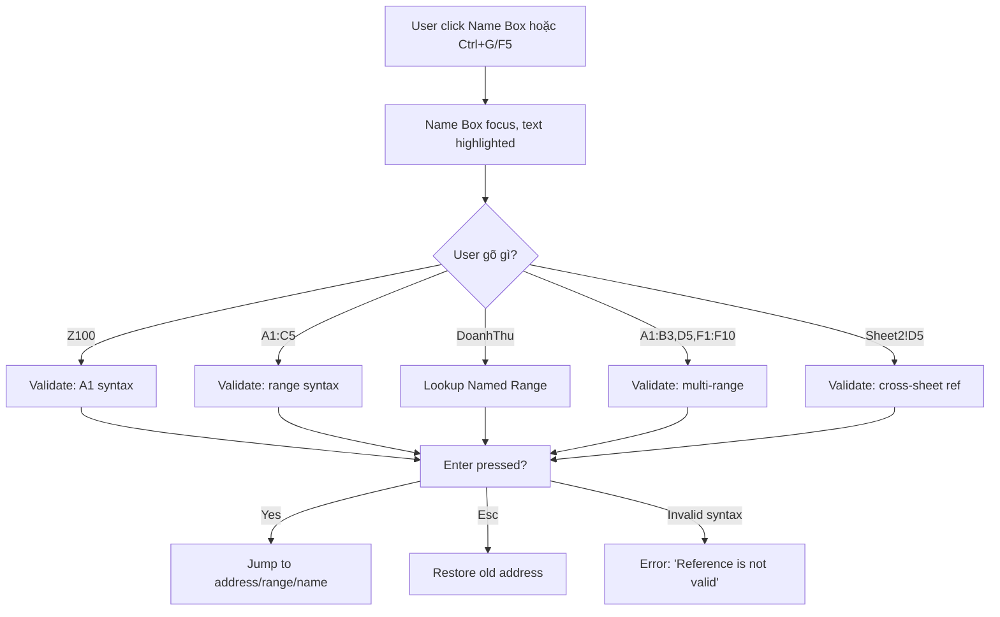
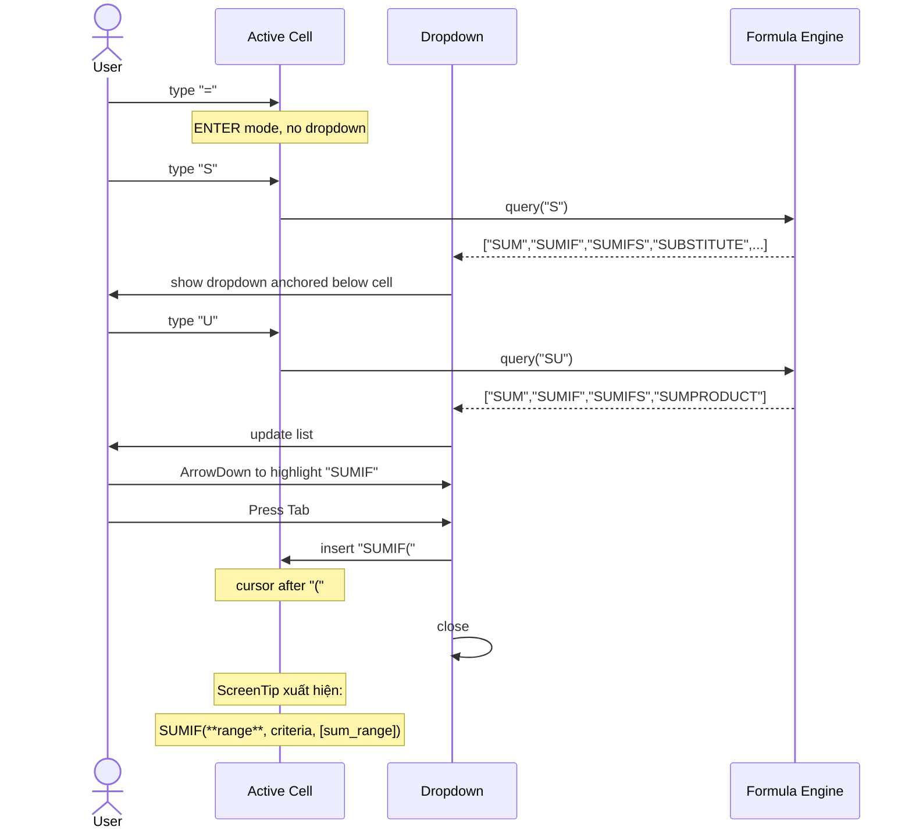
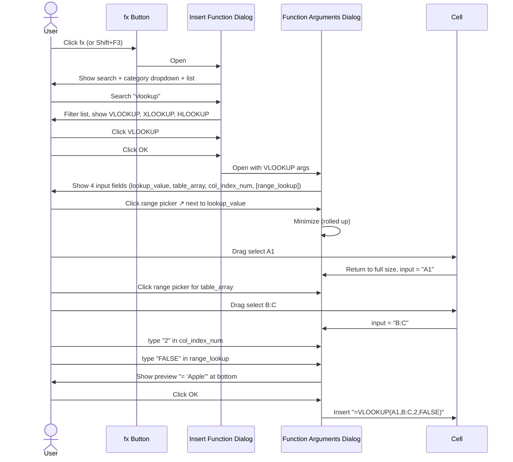

# UX Flow — Spec 04 Name Box & Formula Bar

> Spec gốc: [../04-name-box-formula-bar.md](../04-name-box-formula-bar.md)

## Layout — components

```
┌─────────────────────────────────────────────────────────────────┐
│                                                                  │
│  ┌──────────┐ ┌───┐ ┌──────────────────────────────┐ ┌──────┐  │
│  │ Name Box │ │fx │ │      Formula Bar Text Area    │ │ ▼    │  │
│  │  [A1   ▼]│ │   │ │                                │ │      │  │
│  └──────────┘ └───┘ └──────────────────────────────┘ └──────┘  │
│   80-120px wide                                       expand btn │
│                                                                  │
└──────────────────────────────────────────────────────────────────┘
                                       ▲                ▲
                              Confirm ✓ |   Cancel ✗   (chỉ khi đang Edit)
```

## Name Box navigate flow



## Formula Bar states

### State 1: Ready, ô trống
```
┌────────┐ ┌──┐ ┌────────────────────────┐
│  A1    │ │fx│ │                        │
└────────┘ └──┘ └────────────────────────┘
```

### State 2: Ô có số 123
```
┌────────┐ ┌──┐ ┌────────────────────────┐
│  A1    │ │fx│ │ 123                    │
└────────┘ └──┘ └────────────────────────┘
```

### State 3: Ô có công thức =SUM(A1:A10) (kết quả = 55)
```
Cell B5 hiển thị: 55
Formula Bar hiển thị: =SUM(A1:A10)  ← original formula

┌────────┐ ┌──┐ ┌────────────────────────────────┐
│  B5    │ │fx│ │ =SUM(A1:A10)                   │
└────────┘ └──┘ └────────────────────────────────┘
```

### State 4: Edit mode (đang sửa formula)
```
┌────────┐ ┌──┐ ┌──────────────────────────────────┐ ┌─┐ ┌─┐
│  B5    │ │fx│ │ =SUM(A1:A10)|                    │ │✗│ │✓│
└────────┘ └──┘ └──────────────────────────────────┘ └─┘ └─┘
                                            ↑ cursor   Cancel Confirm
```

### State 5: Expand mode (Ctrl+Shift+U) — multi-line
```
┌────────┐ ┌──┐ ┌──────────────────────────────────┐ ┌─┐ ┌─┐
│  B5    │ │fx│ │ =IF(A1>1000,                     │ │✗│ │✓│
└────────┘ └──┘ │     "High",                       │ └─┘ └─┘
                │     IF(A1>500,                    │
                │         "Medium",                  │
                │         "Low"))                    │
                └──────────────────────────────────┘
                                                  ▲
                                            ▼ collapse btn
```

## Autocomplete dropdown flow



## Autocomplete dropdown UI

```
Active Cell B5 đang gõ "=SU":

┌───┬───┬───┬───┐
│ A │ B │ C │ D │
│ 5 │   │=SU|│   │
└───┴───┴───┴───┘
       │
       ▼
┌──────────────────────────────────┐
│ fx SUM           ← keyboard hint │
│ fx SUMIF                         │
│ fx SUMIFS                        │
│ fx SUMPRODUCT                    │
│ fx SUMSQ                         │
│ fx SUMX2MY2                      │
│ fx SUMX2PY2                      │
│ fx SUMXMY2                       │
│ fx SUBSTITUTE                    │
│ fx SUBTOTAL                      │
│ ─────────                        │
│ 📋 SubTotalRange  ← named range │
│ 📋 SummaryTable   ← table name  │
└──────────────────────────────────┘
```

## ScreenTip syntax flow

```mermaid
flowchart LR
    A[User typed "=VLOOKUP("] --> B[ScreenTip xuất hiện]
    B --> C["=VLOOKUP(**lookup_value**, table_array, col_index_num, [range_lookup])"]
    C --> D{User type comma}
    D -->|after lookup_value| E["=VLOOKUP(A1, **table_array**, col_index_num, [range_lookup])"]
    E -->|after table_array| F["=VLOOKUP(A1, B:C, **col_index_num**, [range_lookup])"]
    F -->|after col_index_num| G["=VLOOKUP(A1, B:C, 2, **[range_lookup]**)"]
    G -->|user type ")"| H[ScreenTip closes]
```

ScreenTip mockup:
```
Cell typing: =VLOOKUP(A1, B:C, 2, |
                                  ↑ cursor after 3rd comma

┌─────────────────────────────────────────────────────────────────┐
│ VLOOKUP(lookup_value, table_array, col_index_num, **[range_lookup]**) │
└─────────────────────────────────────────────────────────────────┘
                                                       ↑ bold = current arg
```

## Sequence — Click fx button (Insert Function)



## Implementation hints cho Slave

- **Name Box** = `QLineEdit` (custom subclass) + dropdown `QListView` cho Named Ranges.
- **Formula Bar text area** = `QLineEdit` mode default; switch sang `QPlainTextEdit` khi expand.
- **fx button** = `QPushButton` với icon "fx" (font Italic).
- **Confirm/Cancel buttons** chỉ visible khi `MainWindow.mode in {ENTER, EDIT}` (signal-driven).
- **Autocomplete dropdown** = floating `QListWidget` anchored cell bottom-left; trigger sau key event với debounce 50ms.
- **ScreenTip** = `QLabel` styled tooltip, position dưới active cell; track current arg index bằng parser (count commas after `(`).
