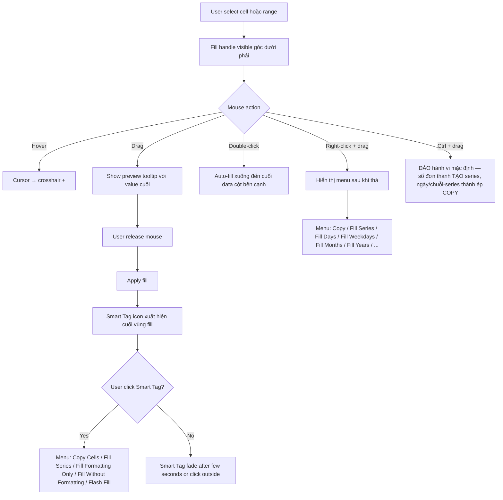
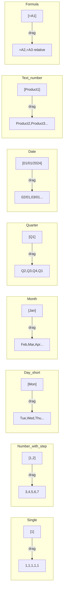
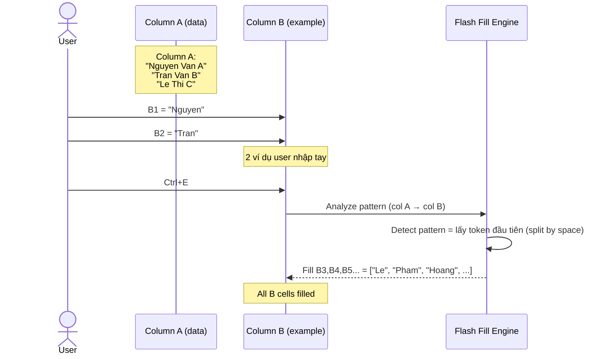
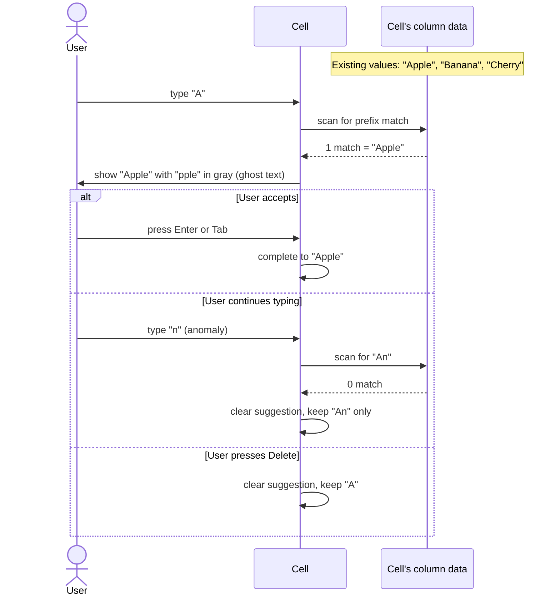
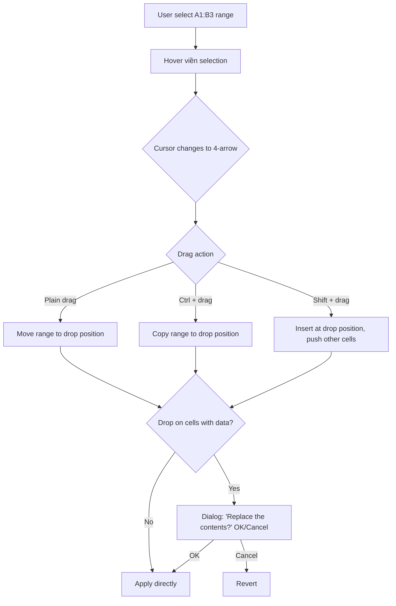

# UX Flow — Spec 05 AutoFill / AutoComplete / Flash Fill / Drag & Drop

> Spec gốc: [../05-data-entry-autofill.md](../05-data-entry-autofill.md)

## Fill Handle UI states

### Idle — selection có fill handle
```
┌───┬───┬───┐
│   │   │   │
│   │▓██│   │  ← selected B5
│   │   │   │  
└───┴───┴─█─┘  ← fill handle (4x4px green square)
              góc dưới phải
```

### Hover fill handle
```
┌───┬───┬───┐
│   │▓██│   │
│   │   │   │
└───┴───┴─█─┘
          ▲
          + (cursor đổi thành crosshair đen mỏng)
```

### Drag fill handle xuống 5 cells
```
┌───┬───┬───┐
│   │▓██│   │  B5 = 1
│   │██▓│   │  drag start
│   │   │   │
│   │   │   │  ← preview tooltip:
│   │   │   │     "5"
└───┴───┴───┘  ← drop position
```

## AutoFill drag flow



## Smart Tag (Auto Fill Options) UI

Sau khi fill A1=1 drag xuống A10 (kéo thường, KHÔNG giữ Ctrl):
```
┌───┐
│ 1 │ A1
├───┤
│ 1 │  ← mặc định COPY: tất cả = 1
├───┤
│ 1 │
...
├───┤
│ 1 │ A10
├───┤
│   │
└───┘
     ┌─⌄┐  ← Smart Tag icon (góc dưới phải vùng fill)
     └──┘
     
Click icon → menu:
┌────────────────────────────┐
│ ● Copy Cells               │  ← mặc định cho SỐ đơn = Copy
│ ◯ Fill Series              │  ← chọn cái này → 1,2,3,...,10
│ ◯ Fill Formatting Only     │
│ ◯ Fill Without Formatting  │
│ ──────────────────────────  │
│ ◯ Flash Fill               │
└────────────────────────────┘
```

> **Số đơn:** kéo thường = **copy** (1,1,…); muốn 1,2,3… thì chọn *Fill Series*
> hoặc **giữ Ctrl khi kéo**. Ngược lại với chuỗi-series (ngày, "Mon", "Q1"): kéo
> thường = **series**, giữ Ctrl khi kéo = **copy**. (Hai-số làm seed như 1,3 →
> series 1,3,5,… ngay cả khi kéo thường.)

## Pattern recognition examples



## Flash Fill (Ctrl+E) flow



### Flash Fill auto-suggestion (khi gõ)

```
User đang gõ row 3 sau khi đã làm 2 row đầu:

Col A         Col B
"Nguyen Van A" "Nguyen"
"Tran Van B"   "Tran"
"Le Thi C"     [Le      ] ← user just typed "L"
"Pham..."      [Pham    ]  ← ghost preview xám
"Hoang..."     [Hoang   ]  ← Flash Fill suggest
"Do..."        [Do      ]
                          
User press Enter → accept all suggestions
User type → reject and continue manual
```

## AutoComplete (text column) flow



### AutoComplete UI

```
Cột A có: Apple, Banana, Cherry

User gõ "A" vào A5:

┌───────────────┐
│Apple          │  ← "A" trắng (user typed), "pple" xám (suggested)
└───────────────┘

→ Enter → cell = "Apple"
→ Backspace → cell = "" (cancel)
→ tiếp tục gõ "B" → suggestion clear, cell = "AB"
```

## Drag & drop cells flow



### Drag & drop visual

```
Step 1 — Hover viền selection:
┌───┬───┬───┬───┐
│   │   │   │   │
│   │▓██│██▓│   │  ← A1:B3 selected
│   │██▓│▓██│   │
│   │▓██│██▓│   │
└───┴───┴───┴───┘
       ▲
       cursor on border → 4-arrow ✣

Step 2 — Drag start (Ctrl held for copy):
┌───┬───┬───┬───┐
│   │░░░│░░░│   │  ← original ghosted
│   │░░░│░░░│   │
│   │░░░│░░░│   │
└───┴───┴───┴───┘
              ╲
               ╲   drag direction
                ▼
┌───┬───┬───┬───┐
│   │   │██░│██░│  ← drop preview
│   │   │░██│██░│
│   │   │░░░│██░│
└───┴───┴───┴───┘
        ▲
        cursor + tooltip "D1:E3"
```

## Right-click drag menu

```
After right-click drag from A1 to A10:

┌──────────────────────────────────────┐
│ ● Copy Cells                          │
│ ◯ Fill Series                         │
│ ◯ Fill Formatting Only                │
│ ◯ Fill Without Formatting             │
│ ──────────────────────────────────── │
│ ◯ Fill Days                           │
│ ◯ Fill Weekdays                       │
│ ◯ Fill Months                         │
│ ◯ Fill Years                          │
│ ──────────────────────────────────── │
│ ◯ Linear Trend                        │
│ ◯ Growth Trend                        │
│ ──────────────────────────────────── │
│ ◯ Series...                           │  ← opens Series dialog
└──────────────────────────────────────┘
```

## Implementation hints cho Slave

- **Fill handle render** trong `CellDelegate.paint()` khi cell là góc dưới phải của selection.
- **Hit testing**: detect mouse position trong 4x4 region của handle, hot path cần check chỉ selection bounding box.
- **Pattern recognition** = function `detect_pattern(values: list[str]) → Pattern | None`:
  - Check số đơn / arithmetic progression / date / day name / month name / Q + digit / text + trailing digit / formula.
  - Trả `Pattern` object với `next(idx) → str` method.
- **Smart Tag** = floating `QToolButton` overlay anchored cuối vùng fill, parent = MainWindow.
- **Flash Fill engine** = rule-based:
  - Detect operation: substring (split + take N) / case change / format mask / concatenation.
  - Try multiple candidates, score by consistency với user examples.
- **AutoComplete inline suggestion** = render trong delegate (gray text after user input position).
- **Drag & drop**: hook `QTableView.mousePressEvent` + `mouseMoveEvent`, detect hover on border → change cursor + initiate drag with QDrag.
