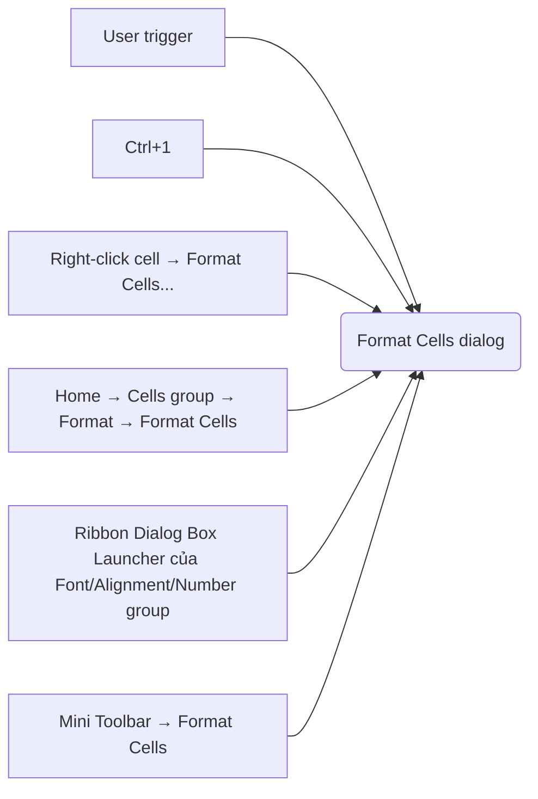
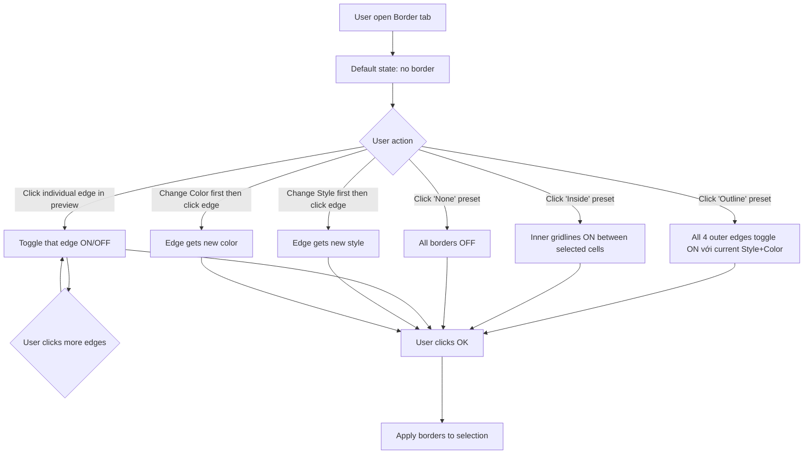
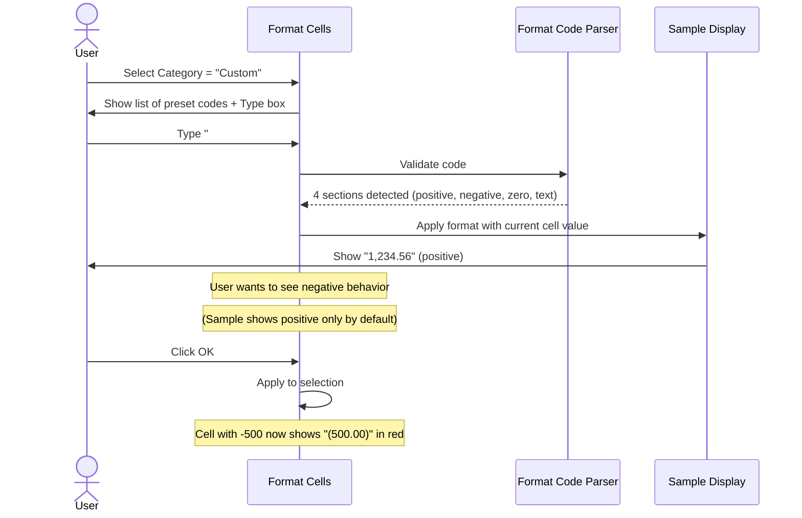

# UX Flow — Spec 08 Format Cells Dialog (Ctrl+1)

> Spec gốc: [../08-format-cells-dialog.md](../08-format-cells-dialog.md)

## Entry points



## Dialog layout — 6 tab

```
┌─ Format Cells ─────────────────────────────────────────────────┐
│ [Number] [Alignment] [Font] [Border] [Fill] [Protection]        │
│ ──────────────────────────────────────────────────────────────│
│ (Active tab content here)                                       │
│                                                                  │
│                                                                  │
│                                                                  │
│                                                                  │
│                                                                  │
│                                                                  │
│ ──────────────────────────────────────────────────────────────│
│                                              [ OK ]  [ Cancel ] │
└─────────────────────────────────────────────────────────────────┘
```

## Tab Number layout

```
┌─ Format Cells / Number ────────────────────────────────────────┐
│ [Number] [Alignment] [Font] [Border] [Fill] [Protection]        │
│ ──────────────────────────────────────────────────────────────│
│ Category:              Sample:                                  │
│ ┌───────────────────┐  ┌────────────────────────────────┐     │
│ │ General           │  │  $1,234.56                      │     │
│ │ Number            │  └────────────────────────────────┘     │
│ │ Currency  ▶        │                                          │
│ │ Accounting        │   Decimal places: [2  ▲▼]                │
│ │ Date              │                                          │
│ │ Time              │   Symbol: [$ English (US)        ▼]     │
│ │ Percentage        │                                          │
│ │ Fraction          │   Negative numbers:                      │
│ │ Scientific        │   ┌──────────────────────────────────┐  │
│ │ Text              │   │ $-1,234.10                         │  │
│ │ Special           │   │ $1,234.10                          │  │
│ │ Custom            │   │ ($1,234.10)         ← selected     │  │
│ └───────────────────┘   │ ($1,234.10)  (red)                 │  │
│                         └──────────────────────────────────┘  │
│                                                                  │
│ Description:                                                     │
│ Currency formats are used for general monetary values...        │
│ ──────────────────────────────────────────────────────────────│
│                                              [ OK ]  [ Cancel ] │
└─────────────────────────────────────────────────────────────────┘
```

## Tab Border — interactive border picker

```
┌─ Format Cells / Border ────────────────────────────────────────┐
│ [Number] [Alignment] [Font] [Border] [Fill] [Protection]        │
│ ──────────────────────────────────────────────────────────────│
│ Presets:                Line:                                    │
│ ┌──┐ ┌──┐ ┌──┐         Style:                                   │
│ │  │ │██│ │██│         ┌───────────────────┐                   │
│ │  │ │██│ │██│         │ (None)            │                   │
│ └──┘ └██┘ └██┘         │ ─────────         │                   │
│ None Outline Inside    │ ─────  (dashed)   │                   │
│                        │ ............      │                   │
│ Border (preview):      │ ▓▓▓▓▓▓▓▓ (thick)  │                   │
│   ┌─[Top]─┐            │ ════════ (double) │                   │
│   │       │            │ ─ ─ ─ ─ ─        │                   │
│   │ [LR]  │            └───────────────────┘                   │
│  [Diag] [Diag2]                                                  │
│   │       │            Color:                                    │
│   └[Bottom]┘           ┌──────────────────┐                    │
│                         │ ■ Automatic ▼    │                    │
│                         └──────────────────┘                    │
│  Click cạnh để toggle                                            │
│                                                                  │
│  ☐ Same line for diagonal                                        │
│ ──────────────────────────────────────────────────────────────│
│                                              [ OK ]  [ Cancel ] │
└─────────────────────────────────────────────────────────────────┘
```

## Tab Border interactive flow



## Tab Number — Custom format code flow



## Custom format code visual breakdown

```
Format code: #,##0.00_);[Red](#,##0.00);0.00;"N/A: "@

  ┌──────────────────────────────────────────────┐
  │ Section 1 (positive): #,##0.00_)              │  → 1234.5 → "1,234.50 "
  │ Section 2 (negative): [Red](#,##0.00)         │  → -1234.5 → "(1,234.50)" red
  │ Section 3 (zero):     0.00                    │  → 0 → "0.00"
  │ Section 4 (text):     "N/A: "@                │  → "abc" → "N/A: abc"
  └──────────────────────────────────────────────┘
                    ▲
            ; separator between sections
```

## Tab Font

```
┌─ Format Cells / Font ──────────────────────────────────────────┐
│ [Number] [Alignment] [Font] [Border] [Fill] [Protection]        │
│ ──────────────────────────────────────────────────────────────│
│ Font:                          Font style:    Size:              │
│ ┌─────────────────────────┐  ┌──────────┐  ┌────┐              │
│ │ Aptos Narrow      ✓     │  │ Regular  │  │ 11 │              │
│ │ Aptos                    │  │ Italic   │  │ 12 │              │
│ │ Arial                    │  │ Bold     │  │ 14 │              │
│ │ Calibri                  │  │ Bold     │  │ 16 │              │
│ │ Cambria                  │  │ Italic   │  │ 18 │              │
│ │ ...                      │  │          │  │... │              │
│ └─────────────────────────┘  └──────────┘  └────┘              │
│                                                                  │
│ Underline:                    Color:                             │
│ ┌──────────────────────┐    ┌──────────────────┐               │
│ │ None              ✓  │    │ ■ Automatic   ▼  │               │
│ └──────────────────────┘    └──────────────────┘               │
│                                                                  │
│ Effects:                      Preview:                           │
│ ☐ Strikethrough              ┌────────────────────┐            │
│ ☐ Superscript                │  AaBbCcYyZz        │            │
│ ☐ Subscript                  └────────────────────┘            │
│                                                                  │
│ ☑ Normal font                                                   │
│ ──────────────────────────────────────────────────────────────│
│                                              [ OK ]  [ Cancel ] │
└─────────────────────────────────────────────────────────────────┘
```

## Tab Fill

```
┌─ Format Cells / Fill ──────────────────────────────────────────┐
│ [Number] [Alignment] [Font] [Border] [Fill] [Protection]        │
│ ──────────────────────────────────────────────────────────────│
│ Background Color:                Pattern Color:                  │
│ ┌─────────────────────────┐    ┌──────────────────┐            │
│ │ No Color   [More]   ⌄   │    │ ■ Automatic   ▼  │            │
│ │                          │    └──────────────────┘            │
│ │ ▓▓▓▓ Theme Colors        │    Pattern Style:                  │
│ │ ▓▓▓▓                     │    ┌──────────────────┐            │
│ │                          │    │ (None)        ▼  │            │
│ │ ▓▓▓▓ Standard Colors     │    └──────────────────┘            │
│ │ ▓▓▓▓                     │                                    │
│ │                          │    [Fill Effects...] [More Colors] │
│ │ Recent Colors            │                                    │
│ │ ▓▓                       │                                    │
│ └─────────────────────────┘                                    │
│                                                                  │
│ Sample:                                                          │
│ ┌────────────────────────────┐                                  │
│ │                              │  ← preview                       │
│ │                              │                                  │
│ └────────────────────────────┘                                  │
│ ──────────────────────────────────────────────────────────────│
│                                              [ OK ]  [ Cancel ] │
└─────────────────────────────────────────────────────────────────┘
```

## Tab Alignment

```
┌─ Format Cells / Alignment ─────────────────────────────────────┐
│ [Number] [Alignment] [Font] [Border] [Fill] [Protection]        │
│ ──────────────────────────────────────────────────────────────│
│ Text alignment             │  Orientation                       │
│  Horizontal: [General   ▼] │   ┌───────────┐                    │
│   (General/Left(Indent)/   │   │     Text  │  ← kim xoay        │
│    Center/Right(Indent)/   │   │    •      │   kéo hoặc gõ độ    │
│    Fill/Justify/Center     │   │   Text    │                    │
│    Across Selection/       │   └───────────┘                    │
│    Distributed)            │   Degrees: [ 0 ]°  (-90…90)         │
│  Vertical:   [Bottom    ▼] │                                    │
│   (Top/Center/Bottom/      │                                    │
│    Justify/Distributed)    │                                    │
│  Indent: [ 0 ]             │                                    │
│ ───────────────────────────┤                                    │
│ Text control               │                                    │
│  ☐ Wrap text               │                                    │
│  ☐ Shrink to fit           │                                    │
│  ☐ Merge cells             │                                    │
│ ───────────────────────────┤                                    │
│ Right-to-left              │                                    │
│  Text direction: [Context ▼] (Context/Left-to-Right/Right-to-Left)│
│ ──────────────────────────────────────────────────────────────│
│                                              [ OK ]  [ Cancel ] │
└─────────────────────────────────────────────────────────────────┘
```

> Lưu ý: *Shrink to fit* và *Wrap text* loại trừ nhau; *Merge cells* + *Center
> Across Selection* khác nhau (merge gộp ô thật, center-across chỉ canh hiển thị).

## Tab Protection

```
┌─ Format Cells / Protection ────────────────────────────────────┐
│ [Number] [Alignment] [Font] [Border] [Fill] [Protection]        │
│ ──────────────────────────────────────────────────────────────│
│  ☑ Locked                                                       │
│  ☐ Hidden                                                       │
│                                                                  │
│  ⓘ Khóa ô hoặc ẩn công thức CHỈ có tác dụng sau khi bảo vệ      │
│    sheet (Review → Protect Sheet). Mặc định mọi ô đều Locked;   │
│    muốn cho sửa vài ô thì bỏ Locked ở ô đó rồi mới Protect.     │
│    Hidden = ẩn công thức trên Formula Bar khi sheet được bảo vệ.│
│ ──────────────────────────────────────────────────────────────│
│                                              [ OK ]  [ Cancel ] │
└─────────────────────────────────────────────────────────────────┘
```

> Protection tab chỉ set cờ `locked`/`hidden` trên ô — hành vi thật do
> [Spec 29 Protection](../29-protection.md) thực thi khi Protect Sheet bật.

## Implementation hints cho Slave

- **Dialog** = `QDialog` modal, parent = MainWindow.
- **Tab widget** = `QTabWidget` với 6 page widgets.
- **Number tab Category list** = `QListWidget`; on select → swap right-side content widget.
- **Custom format parser** trong `formula.py` extension hoặc `number_format.py` module mới:
  - Parse 1-4 sections separated by `;`.
  - Tokenize: digit placeholders `#0?` / decimal `.` / thousand `,` / percent `%` / scientific `E+E-` / color `[Red]` / conditional `[>1000]` / literal `"..."` / escape `\<c>` / spacer `_<c>` / repeat `*<c>` / text `@`.
  - Format value → string per current section based on sign.
- **Border tab preview** = custom `QWidget` với `paintEvent`; hit-test click → toggle edge dict.
- **Fill tab color picker** = `QColorDialog` for "More Colors"; theme colors gallery custom widget.
- **Live preview** trong Sample box: re-render khi tab content change.
- **Apply on OK**: collect dict format → call `model.set_format(selection_range, fmt_dict)` với `_push_undo()` đầu.
