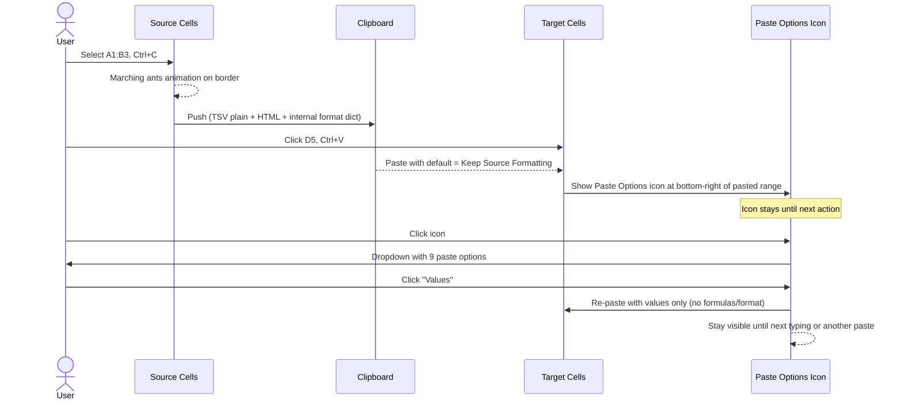
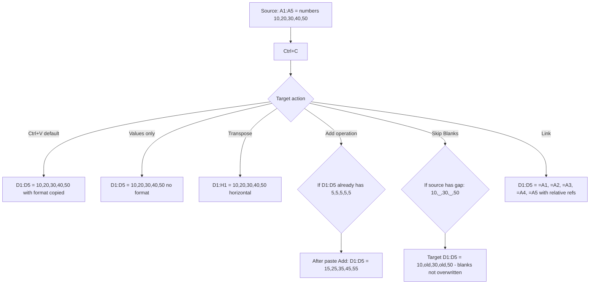
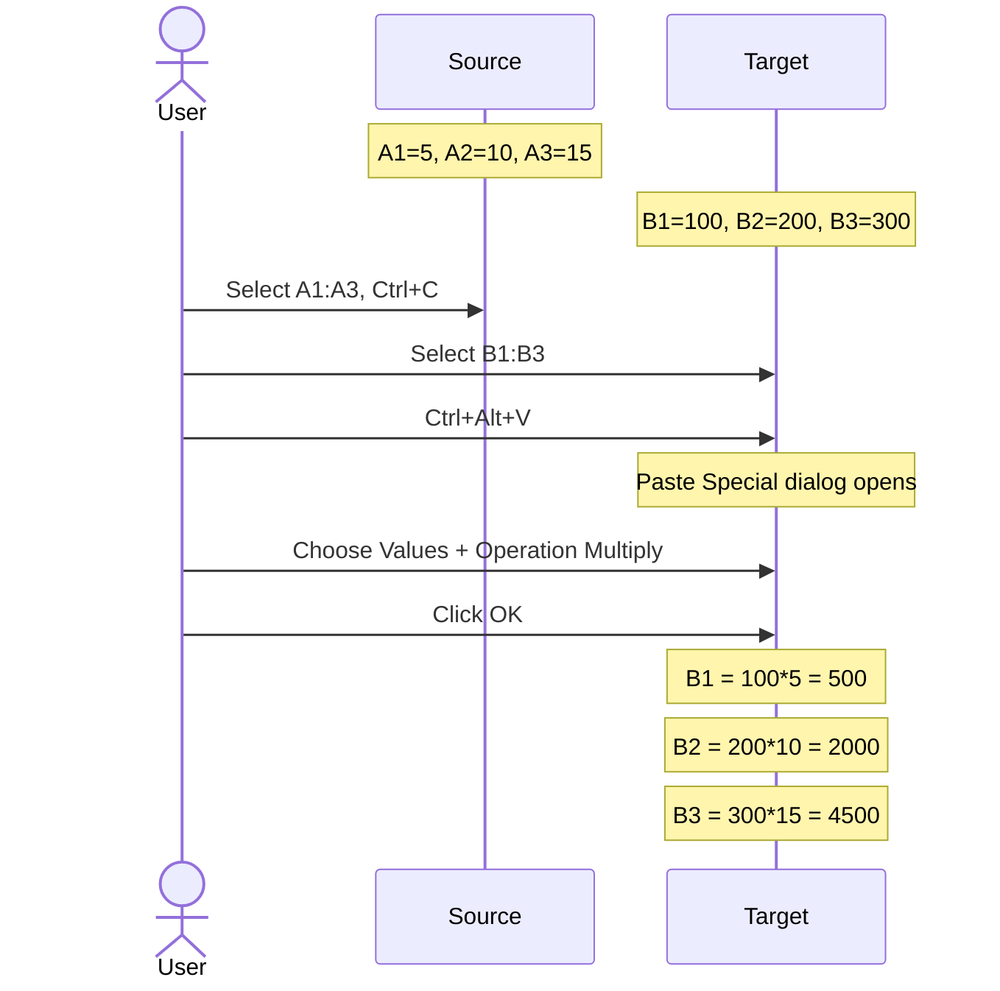
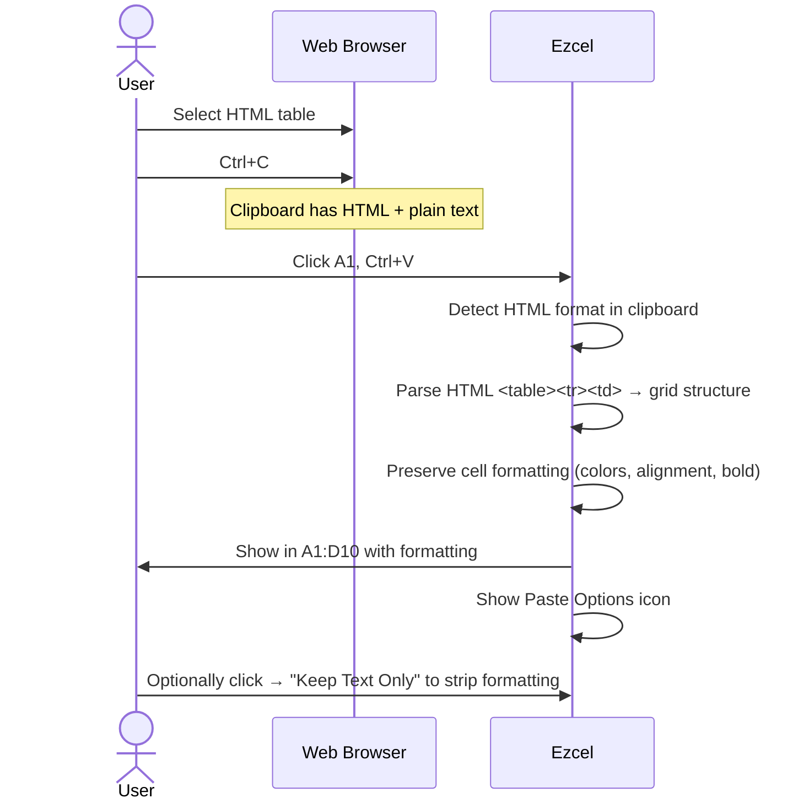

# UX Flow — Spec 13 Clipboard & Paste Special

> Spec gốc: [../13-clipboard-paste-special.md](../13-clipboard-paste-special.md)

## Copy → Paste flow



## Marching ants animation

```
Step 1 — Just copied A1:B3:
┌──┬──┬──┬──┐
│- │- │  │  │  ← top border dashed animating
│ -│  │  │  │  ← right border dashed
│  │  │  │  │
│ -│- │  │  │  ← bottom border dashed
└──┴──┴──┴──┘

Step 2 — Animation cycles (offset every ~200ms):
┌──┬──┬──┬──┐
│ -│ -│  │  │
│- │  │  │  │
│  │  │  │  │
│ -│ -│  │  │
└──┴──┴──┴──┘

Press Esc → animation stops, clipboard cleared.
```

## Paste Options icon-bar

```
After Ctrl+V at D5 (vùng dán):
┌──┬──┬──┐
│  │  │  │
│  │  │██│  ← D5:E7 vừa paste
│  │  │██│
└──┴──┴──┘
         ╲
          ▼
         ┌─⌄┐
         │📋│  ← Paste Options icon ở góc dưới phải vùng dán
         └──┘
         
Click icon → menu:
┌────────────────────────────────────────────┐
│ Paste                                       │
│ ┌──┐ ┌──┐ ┌──┐ ┌──┐                       │
│ │📋│ │123│ │fx│ │ T │                       │
│ │K │ │ V │ │F │ │ T │  ← row 1: 4 icons   │
│ └──┘ └──┘ └──┘ └──┘                       │
│ Keep   Values Form. Formatting              │
│ Source  (V)   (F)   only (T)                │
│                                              │
│ ┌──┐ ┌──┐ ┌──┐ ┌──┐                       │
│ │A │ │⤴│ │🔗│ │📷│                        │
│ └──┘ └──┘ └──┘ └──┘                       │
│ Values Trans- Link  Picture                  │
│ & Src  pose                                  │
│  (A)   (E)   (N)                            │
│                                              │
│ Paste Special...  ← opens full dialog       │
└────────────────────────────────────────────┘

Press 'V' on keyboard (after Ctrl+V) → quick select Values
```

## Paste Special dialog (Ctrl+Alt+V)

```
┌─ Paste Special ─────────────────────────────────────┐
│ Paste                                                │
│ ● All                       ◯ All using Source theme │
│ ◯ Formulas                  ◯ All except borders     │
│ ◯ Values                    ◯ Column widths          │
│ ◯ Formats                   ◯ Formulas and number    │
│ ◯ Comments and Notes          formats                │
│ ◯ Validation                ◯ Values and number      │
│                               formats                │
│                                                       │
│ Operation                                            │
│ ● None     ◯ Add                                     │
│ ◯ Subtract ◯ Multiply                                │
│ ◯ Divide                                             │
│                                                       │
│ ☐ Skip Blanks      ☐ Transpose                       │
│                                                       │
│  [Paste Link]   [ OK ]   [ Cancel ]                  │
└──────────────────────────────────────────────────────┘
```

## Paste Special use cases



## Skip Blanks visual example

```
Source A1:A5:
┌──┐
│10│
│  │  ← blank
│30│
│  │  ← blank
│50│
└──┘

Target D1:D5 already has:
┌──┐
│ 1│
│ 2│
│ 3│
│ 4│
│ 5│
└──┘

After Ctrl+Alt+V → Skip Blanks → OK:
┌──┐
│10│  ← overwritten
│ 2│  ← NOT overwritten (source blank)
│30│  ← overwritten
│ 4│  ← NOT overwritten
│50│  ← overwritten
└──┘
```

## Transpose visual example

```
Source A1:A4 (vertical):
┌──┐
│ 1│
│ 2│
│ 3│
│ 4│
└──┘

After Paste Special → ☑ Transpose at D1:
┌──┬──┬──┬──┐
│ 1│ 2│ 3│ 4│  ← horizontal D1:G1
└──┴──┴──┴──┘
```

## Operation paste flow



## Clipboard pane (Home → Clipboard launcher)

> ⚠ Phím tắt **Ctrl+C 2 lần** để mở Office Clipboard đã bị **gỡ ở Office 365 hiện
> đại** — đừng implement. Cách mở duy nhất bây giờ: tab **Home → nhóm Clipboard →
> nút launcher (mũi tên góc dưới-phải)**. Giữ Ctrl+C-twice chỉ để tham khảo legacy.

```
┌─ Clipboard (Office) ───────────────────┐
│ [Paste All]  [Clear All]                │
│ ──────────────────────────────────────  │
│ ▼ Click an item to paste:                │
│                                          │
│ 📋 1,234.56                              │
│    (latest, from Sheet1!A1)              │
│                                          │
│ 📋 "Nguyen Van A"                        │
│    (from Sheet1!B5)                      │
│                                          │
│ 📋 =SUM(A1:A10)                          │
│    (from Sheet2!C3)                      │
│                                          │
│ 📋 [Image]                               │
│    (from Word)                           │
│                                          │
│ ... (max 24 items)                       │
│ ──────────────────────────────────────  │
│ Options ▼                                │
└──────────────────────────────────────────┘

Modern alternative:
- Win+V → Windows Clipboard History (system-level, cross-app)
```

## Drag & drop from external app



## Implementation hints cho Slave

- **Clipboard format**: Excel pushes 3+ formats:
  - `text/plain` (TSV)
  - `text/html` (with full styling)
  - `application/vnd.ms-excel` (internal binary blob)
- **Internal copy** trong Ezcel: dùng cấu trúc dict `{cells: matrix, format: matrix, formulas: matrix}` lưu trong app singleton; ngoài còn push plain TSV + HTML to system clipboard for interop.
- **Marching ants**: `QTimer.singleShot(200ms, ...)` cycle dash offset; redraw selection range with `QPen(Qt.DashLine)` styled.
- **Paste Options icon**: floating `QToolButton` overlay anchored bottom-right của pasted range; persists until next type/paste/Esc.
- **Paste Special dialog**: standard `QDialog` với radio groups + checkboxes.
- **Skip Blanks logic**: when applying paste, for each source cell that's empty → skip writing to target.
- **Transpose**: matrix transpose `[[a,b],[c,d]] → [[a,c],[b,d]]` before paste.
- **Operation paste**: load existing target values, apply op cell-by-cell, write back.
- **HTML paste from external**: parse with `lxml.html` or built-in Python `html.parser`; map CSS styles → format dict.
