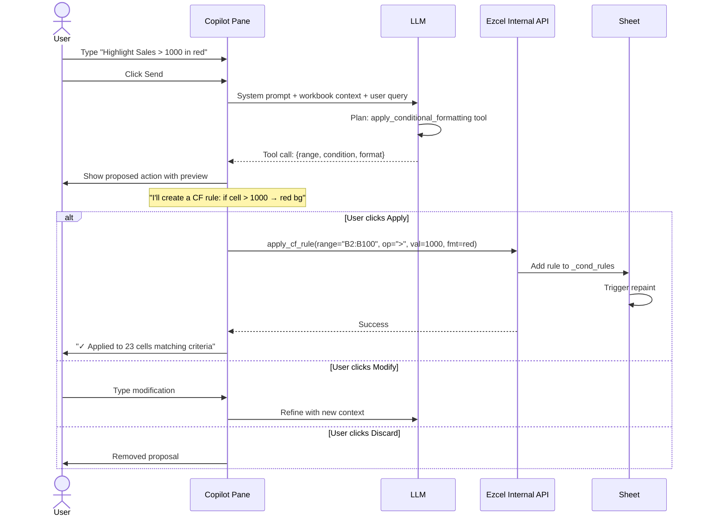
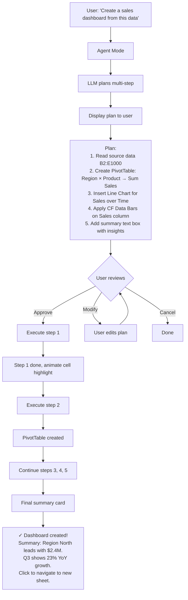
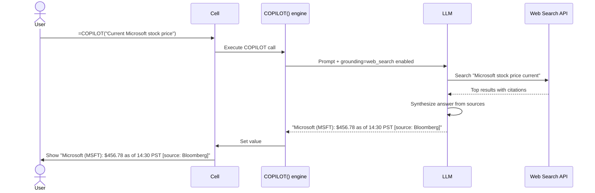

# UX Flow — Spec 39 Copilot / Agent Mode / Edit with Copilot

> Spec gốc: [../39-copilot-agent.md](../39-copilot-agent.md)
>
> ⚠ **Lưu ý độ tin cậy:** một số chi tiết trong doc này là **mục tiêu thiết kế của
> Ezcel lấy cảm hứng từ roadmap Excel**, KHÔNG phải sự thật Excel đã ship. Cụ thể:
> menu chọn model trong Settings, các mốc "May 2026 / June 2026", thẻ "Edited by
> Copilot" theo từng ô, và web-search GA — đều là **suy đoán/đặc thù Ezcel**, đừng
> code như fact. Phần đã xác minh thật: Agent Mode GA (web Dec 2025, desktop ~T1/2026,
> toàn bộ Office 22/04/2026), lỗi async `#BUSY!`, hàm `=COPILOT()` (Frontier/Insider,
> ~100 lần/10 phút). Nguồn: Microsoft Support / TechCommunity.

## Copilot entry points (May 2026 consolidated)

```
Modern Excel May 2026: 2 main entry points

┌──────────────────────────────────────────────────────────┐
│ [File] [Home] [Insert] [Page] [Formulas] [Data] [Review] │ ← Ribbon
│                                                            │
│       [✦ Copilot]              ← Entry 1: Ribbon button   │
│                                                            │
├──────────────────────────────────────────────────────────┤
│                                                            │
│         Spreadsheet grid                                   │
│                                                            │
│                                                            │
│                                                            │
│                                                            │
│                                                            │
│         ┌─────────────────┐                               │
│         │ ✦ Ask Copilot   │ ← Entry 2: Floating button    │
│         └─────────────────┘   (cuối selection lớn)        │
│                                                            │
└──────────────────────────────────────────────────────────┘
```

## Copilot pane layout

```
┌─ Copilot ──────────────────────────────┐
│ [< back to chat]  [⚙ Settings]  [📌 Dock] │
│ ──────────────────────────────────────  │
│                                          │
│ ┌─────────────────────────────────────┐ │
│ │ Suggested prompts:                   │ │
│ │ ┌────────────────┐                  │ │
│ │ │ Add column for │                  │ │
│ │ │ profit margin  │                  │ │
│ │ └────────────────┘                  │ │
│ │ ┌────────────────┐                  │ │
│ │ │ Highlight rows  │                  │ │
│ │ │ where Sales>1M  │                  │ │
│ │ └────────────────┘                  │ │
│ │ ┌────────────────┐                  │ │
│ │ │ Create PivotTbl │                  │ │
│ │ │ by region       │                  │ │
│ │ └────────────────┘                  │ │
│ └─────────────────────────────────────┘ │
│                                          │
│ ── Conversation ──                       │
│ 👤 Add a column showing profit margin... │
│                                          │
│ 🤖 I'll add a new column "Margin" with   │
│    formula =D2/C2 in row 2 and copy     │
│    down. Preview:                        │
│    ┌──────────────────────────────┐     │
│    │ Margin                        │     │
│    │ 0.45                          │     │
│    │ 0.32                          │     │
│    │ 0.58                          │     │
│    └──────────────────────────────┘     │
│    [Apply]  [Modify]  [Discard]          │
│                                          │
│ ──────────────────────────────────────  │
│ [Chat / Edit ▼]                          │
│ ┌──────────────────────────────────┐    │
│ │ Type your message...              │ 🎤 │
│ └──────────────────────────────────┘    │
│                          [Send ▶]        │
└──────────────────────────────────────────┘
```

## Single-action Copilot flow



## Agent Mode flow



## Edit with Copilot (March 2026+) flow

```mermaid
sequenceDiagram
    actor User
    participant Cell
    participant Pane as Copilot Pane
    participant LLM
    participant DiffView as Show Changes Card

    Note over Pane: User in "Edit" tab (not Chat)
    
    User->>Pane: Type "Fix the formula errors in column F"
    User->>Pane: Click Send
    
    Pane->>LLM: Analyze column F formulas
    LLM->>LLM: Step-by-step reasoning visible
    Note over Pane: "Reasoning:
    1. Found #DIV/0! in F5 - division by B5 which is 0
    2. Suggest IFERROR wrapper
    3. Found #VALUE! in F12 - text + number
    4. Suggest VALUE() conversion"
    
    LLM-->>Pane: Proposed edits (5 cells)
    
    Pane->>DiffView: Show changes pending
    DiffView->>User: Side-by-side diff
    Note over DiffView: F5: =A5/B5 → =IFERROR(A5/B5, 0)
    Note over DiffView: F12: =A12+B12 → =A12+VALUE(B12)
    
    User->>DiffView: Click Apply All
    DiffView->>Cell: Apply changes
    
    Note over Cell: Each cell shows Copilot attribution icon
    Note over Cell: Hover → "Edited by Copilot, June 3 2026 11:35"
```

## =COPILOT() formula function (in-cell LLM)

> **Chữ ký thật (Excel M365):** `=COPILOT(prompt_part1, [context1], [prompt_part2], [context2], …)`
> — prompt và vùng context **đan xen nhau**, có thể spill ra mảng động. Hàm hiện
> ở kênh Frontier/Insider, giới hạn ~100 lần gọi / 10 phút, trả `#BUSY!` khi đang
> chạy async. Ví dụ rút gọn dưới đây ghép prompt bằng `&` cho dễ đọc; bản đầy đủ
> nên nhận context là tham số riêng (vd `=COPILOT("Translate to English:", A1)`).

```
Cell A1 contains: "Xin chào bạn"

User in B1 types: =COPILOT("Translate to English:", A1)

Step 1 — Cell B1 shows: #BUSY!
        (LLM call in flight, async)

Step 2 — After ~2s, cell B1 updates: "Hello you"

User changes A1: "Tạm biệt"

Step 3 — B1 automatically recalc: #BUSY! → "Goodbye"
```

## =COPILOT web search (Insiders May 2026 / GA June 2026)



## Show Changes card (June 2026 Copilot attribution)

```
Sheet view with Show Changes pane active:

┌─ Changes ──────────────────────────────┐
│ Sort: Newest first ▼                    │
│ ──────────────────────────────────────  │
│                                          │
│ ┌──────────────────────────────────┐    │
│ │ ✦ Nguyen + Copilot               │ ← Copilot attribution flag │
│ │ 5 min ago                         │    │
│ │ ──────────────────────────────── │    │
│ │ B5: =A5/B5  →  =IFERROR(A5/B5,0) │    │
│ │ B12: =A12+B12 → =A12+VALUE(B12)  │    │
│ │ ...                                │    │
│ │                                    │    │
│ │ Edit prompt: "Fix formula errors  │    │
│ │ in column F"                       │    │
│ └──────────────────────────────────┘    │
│                                          │
│ ┌──────────────────────────────────┐    │
│ │ 👤 Trang                          │    │
│ │ 10 min ago                        │    │
│ │ A1: changed value 5 → 10          │    │
│ └──────────────────────────────────┘    │
│                                          │
└──────────────────────────────────────────┘
```

## Settings panel

> ⚠ **Thiết kế RIÊNG của Ezcel — KHÔNG phải Excel thật.** Excel/Copilot không cho
> user chọn model LLM trong UI (Microsoft quản lý phía sau). Việc cho chọn provider
> (Anthropic / OpenAI) là tính năng đặc thù Ezcel. **Tên & version model bên dưới
> chỉ là placeholder minh họa** — danh sách thật phải lấy từ runtime, đừng hard-code.

```
┌─ Copilot Settings (Ezcel-original) ─────┐
│                                          │
│ Model:                                   │
│ ┌──────────────────────────────────┐   │
│ │ GPT-5.5 (default)             ▼  │   │
│ │ ◯ GPT-5.5                          │   │
│ │ ◯ GPT-4o                           │   │
│ │ ◯ GPT-4o-mini                      │   │
│ │ ◯ Claude Opus 4.7 (Premium only)  │   │
│ │ ◯ Claude Opus 4.6                  │   │
│ │ ◯ Claude Sonnet                    │   │
│ └──────────────────────────────────┘   │
│                                          │
│ Privacy:                                 │
│ ☑ Allow Copilot to read other sheets   │
│ ☐ Send diagnostic data to Microsoft     │
│ ☑ Enable web search (=COPILOT)          │
│                                          │
│ Formula completion:                      │
│ ● On                                     │
│ ◯ Off                                    │
│ ◯ Suggest only on Tab                    │
│                                          │
│ Token budget:                            │
│ Current: 12,340 / 100,000 monthly        │
│ ▓▓▓▓░░░░░░░░░░░░░░░░░  12%             │
│                                          │
│ [Save Settings]  [Reset to Defaults]    │
└──────────────────────────────────────────┘
```

## Implementation hints cho Slave

- **Pane**: `QDockWidget` right side, frameless content `QWidget`.
- **Chat conversation**: `QTextBrowser` (rich HTML) hoặc custom widget with message bubbles.
- **Tool calling**: Anthropic SDK (`anthropic` Python) hoặc OpenAI SDK; define tool schemas for internal API:
  ```python
  tools = [
    {"name": "apply_cf_rule", "input_schema": {...}},
    {"name": "create_pivot_table", "input_schema": {...}},
    {"name": "add_chart", "input_schema": {...}},
    {"name": "edit_cell", "input_schema": {...}},
    {"name": "add_formula_column", "input_schema": {...}},
    {"name": "web_search", "input_schema": {...}},
  ]
  ```
- **Workbook context** sent với mỗi prompt: sheet headers, first 20 rows preview, named ranges, charts/tables list. Compress với prompt caching (Anthropic).
- **Async**: LLM call trong `QThread`; result trả qua signal-slot to update pane.
- **=COPILOT() function** trong `formula._FUNCTIONS`:
  - Mark async/volatile.
  - Cell value = `#BUSY!` while waiting.
  - Cache result by prompt hash.
  - Update cell qua model.setData when response arrives.
- **Token budget tracking**: increment after each call; display in Status Bar + Settings pane.
- **Show Changes card**: similar to Track Changes, log each edit with source attribution.
