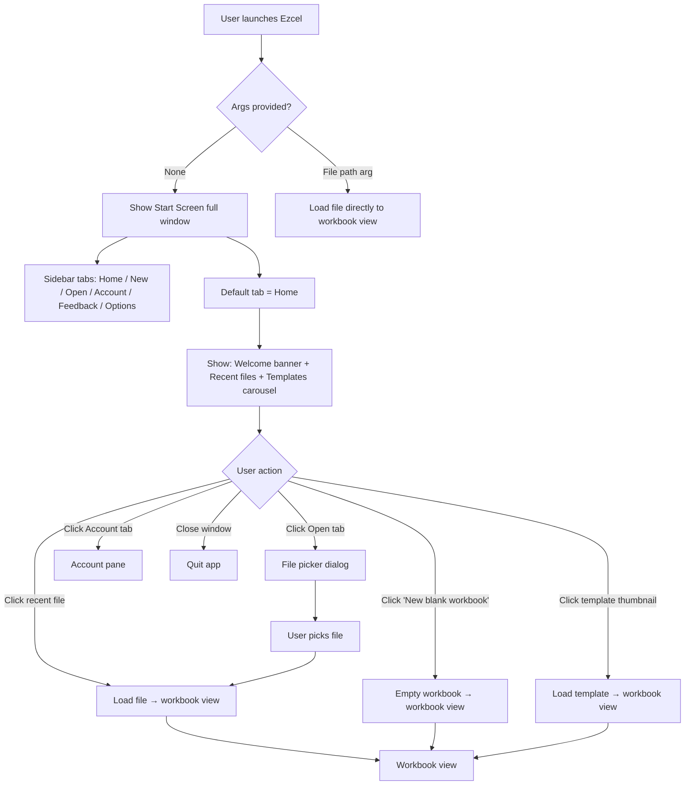
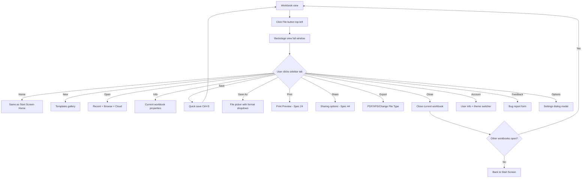
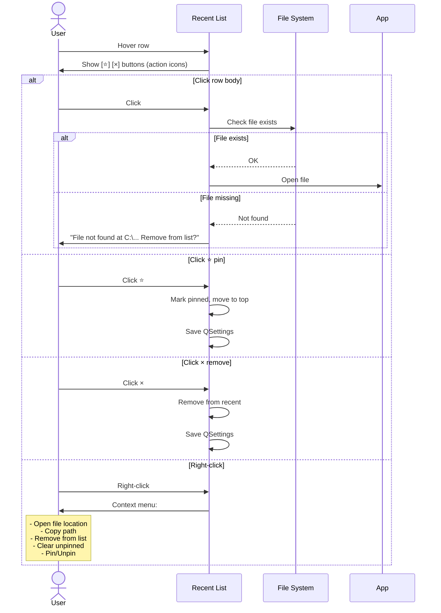

# UX Flow — Spec 51 Start Screen / Backstage

> Spec gốc: [../51-start-screen-backstage.md](../51-start-screen-backstage.md)

## App startup flow



## Start Screen — Home tab mockup

```
┌─ Ezcel ──────────────────────────────────────────────────────────────┐
│ [≡ menu]  [Search templates and online help_____________]  [👤 user] │
├──────────────────┬───────────────────────────────────────────────────┤
│ Home      ◀      │  Good morning, soinhoxiu                           │
│ New              │  ──────────────────────────────────────────────── │
│ Open             │  Quick access:                                      │
│ Account          │  ┌─────────┐ ┌─────────┐ ┌─────────┐               │
│ Feedback         │  │ 🆕 New  │ │ 📂 Open │ │ 📋 Tpl  │               │
│ Options          │  │ blank   │ │  ...    │ │  ...    │               │
│                  │  └─────────┘ └─────────┘ └─────────┘               │
│                  │                                                      │
│                  │  ──────────────────────────────────────────────── │
│                  │  Recent      [Pinned] [Shared with Me]              │
│                  │  ──────────────────────────────────────────────── │
│                  │  📊 Budget 2026.xlsx                                │
│                  │     C:\Users\pc\Documents\         2 hours ago      │
│                  │     [⭐] [×]                                         │
│                  │                                                      │
│                  │  📊 Sales Q1.xlsx                                   │
│                  │     C:\Users\pc\Desktop\           Yesterday        │
│                  │     [⭐] [×]                                         │
│                  │                                                      │
│                  │  📊 Inventory.xlsx                                  │
│                  │     OneDrive\Work                   3 days ago       │
│                  │     [⭐] [×]                                         │
│                  │                                                      │
│                  │  📊 Project Plan.xlsx                               │
│                  │     C:\Users\pc\Projects\          Last week        │
│                  │     [⭐] [×]                                         │
│                  │                                                      │
│                  │  [More workbooks...]                                │
│                  │                                                      │
│                  │  ──────────────────────────────────────────────── │
│                  │  Suggested templates:                                │
│                  │  ┌──────┐ ┌──────┐ ┌──────┐ ┌──────┐ ┌──────┐    │
│                  │  │      │ │  📅  │ │  💰  │ │  📦  │ │  🎯  │    │
│                  │  │Blank │ │ Cal- │ │Budg- │ │ Inv- │ │ Goal │    │
│                  │  │      │ │endar │ │ et   │ │entory│ │Track │    │
│                  │  └──────┘ └──────┘ └──────┘ └──────┘ └──────┘    │
│                  │                                                      │
│                  │  [More templates ▶]                                 │
└──────────────────┴───────────────────────────────────────────────────┘
```

## File → Backstage navigation



## Backstage Info tab mockup

```
┌─ Ezcel ── Budget 2026.xlsx ──────────────────────────────────────────┐
│ [≡]  [▤ ribbon collapsed]                                  [👤 user]  │
├──────────────────┬───────────────────────────────────────────────────┤
│ Home             │  Info                                               │
│ New              │  ──────────────────────────────────────────────── │
│ Open             │                                                      │
│ Info     ◀       │  📊 Budget 2026.xlsx                                │
│ Save             │     C:\Users\pc\Documents\Budget 2026.xlsx          │
│ Save As          │                                                      │
│ Print            │  ┌────────────────────────────────────────────────┐│
│ Share            │  │ 🔒 Protect Workbook ▼                          ││
│ Export           │  │ Control what types of changes people can make. ││
│ Close            │  └────────────────────────────────────────────────┘│
│ ──────────────   │  ┌────────────────────────────────────────────────┐│
│ Account          │  │ 🔍 Inspect Workbook ▼                          ││
│ Feedback         │  │ Before sharing this file, check for issues:    ││
│ Options          │  │ • Document Inspector                            ││
│                  │  │ • Accessibility Checker                         ││
│                  │  │ • Compatibility Checker                         ││
│                  │  └────────────────────────────────────────────────┘│
│                  │  ┌────────────────────────────────────────────────┐│
│                  │  │ 📂 Manage Workbook ▼                            ││
│                  │  │ Today, 14:30 (no unsaved changes)               ││
│                  │  │ ▸ Recover Unsaved Workbooks                    ││
│                  │  │ ▸ Delete All Unsaved Workbooks                  ││
│                  │  └────────────────────────────────────────────────┘│
│                  │  ┌────────────────────────────────────────────────┐│
│                  │  │ 🕐 Version History (5 versions)                 ││
│                  │  │ Browse and restore previous versions            ││
│                  │  └────────────────────────────────────────────────┘│
│                  │  Properties:                          (sidebar) ▼  │
│                  │  Size: 2.4 MB                                        │
│                  │  Title: Q1 2026 Budget                              │
│                  │  Tags: Add a tag                                    │
│                  │  Categories: Finance                                │
│                  │  Author: Nguyen Van A                               │
│                  │  Last modified by: Nguyen Van A                     │
│                  │  Last modified: Today, 14:30                        │
│                  │  Created: 2026-01-15 09:00                          │
│                  │  Last printed: 2026-02-01 11:23                     │
│                  │                                                      │
│                  │  [Show All Properties]                              │
└──────────────────┴───────────────────────────────────────────────────┘
```

## Backstage New tab mockup

```
┌─ Ezcel ── Backstage ── New ──────────────────────────────────────────┐
│ Home             │  New                                               │
│ New      ◀       │  ──────────────────────────────────────────────── │
│ Open             │  Search for online templates                         │
│ ...              │  ┌──────────────────────────────────────────────┐ │
│                  │  │ [____________________________________________]│ │
│                  │  └──────────────────────────────────────────────┘ │
│                  │  Suggested: Budget · Calendar · Invoice · Plan · │
│                  │             Goal Track · Inventory                 │
│                  │  ──────────────────────────────────────────────── │
│                  │                                                      │
│                  │  ┌────────┐ ┌────────┐ ┌────────┐ ┌────────┐     │
│                  │  │        │ │  📅    │ │  💰    │ │  📊    │     │
│                  │  │ Blank  │ │ Calen- │ │ Budget │ │Tracker │     │
│                  │  │ Work-  │ │  dar   │ │        │ │        │     │
│                  │  │ book   │ │        │ │        │ │        │     │
│                  │  └────────┘ └────────┘ └────────┘ └────────┘     │
│                  │                                                      │
│                  │  ┌────────┐ ┌────────┐ ┌────────┐ ┌────────┐     │
│                  │  │  📦    │ │  🧾    │ │  🎯    │ │  📈    │     │
│                  │  │ Invn-  │ │ Invoi- │ │ Goal-  │ │ KPI    │     │
│                  │  │ tory   │ │   ce   │ │  set   │ │ Dash   │     │
│                  │  └────────┘ └────────┘ └────────┘ └────────┘     │
│                  │                                                      │
│                  │  Categories: Business · Personal · Education · …   │
└──────────────────┴───────────────────────────────────────────────────┘
```

## Backstage Account tab mockup

```
┌─ Ezcel ── Backstage ── Account ──────────────────────────────────────┐
│ Home             │  Account                                            │
│ New              │  ──────────────────────────────────────────────── │
│ Open             │  User Information                                   │
│ ...              │  ┌──────────────────────────────────────────────┐ │
│ Account  ◀       │  │ 👤 Nguyen Van A                               │ │
│                  │  │ phantrongluc001.ezg@gmail.com                  │ │
│                  │  │ [Sign out]   [Switch account]                  │ │
│                  │  └──────────────────────────────────────────────┘ │
│                  │                                                      │
│                  │  Connected Services                                  │
│                  │  ┌──────────────────────────────────────────────┐ │
│                  │  │ • OneDrive (not connected)        [Add]       │ │
│                  │  │ • Google Drive                    [Add]       │ │
│                  │  └──────────────────────────────────────────────┘ │
│                  │                                                      │
│                  │  Office Theme                                       │
│                  │  ┌──────────────────────────────────────────────┐ │
│                  │  │ [Colorful (green Excel header)            ▼] │ │
│                  │  │   ● Colorful (default)                        │ │
│                  │  │   ◯ Dark Gray                                  │ │
│                  │  │   ◯ Black                                      │ │
│                  │  │   ◯ White                                      │ │
│                  │  │   ◯ Use system setting                         │ │
│                  │  └──────────────────────────────────────────────┘ │
│                  │                                                      │
│                  │  Product Information                                 │
│                  │  ┌──────────────────────────────────────────────┐ │
│                  │  │ Ezcel v0.12.1                                  │ │
│                  │  │ License: MIT                                    │ │
│                  │  │ [Check for Updates]                             │ │
│                  │  └──────────────────────────────────────────────┘ │
└──────────────────┴───────────────────────────────────────────────────┘
```

## Recent files interaction flow



## Implementation hints cho Slave

- **`QStackedWidget`** chứa: Start Screen page + Workbook View page + Backstage page (cùng app, switch giữa).
- **Sidebar tabs** = `QListWidget` styled với icon + label; selection-changed → switch content widget.
- **Recent files** = `QSettings.value("recent_files")` list[dict(path, opened_at, pinned)]; max 50 + unlimited pinned.
- **Templates** = bundle `.xltx` files trong `assets/templates/`; mỗi template thumbnail PNG cùng folder.
- **Theme switcher** trong Account tab:
  - "Colorful" → ribbon background green Excel.
  - "Dark Gray" → ribbon + grid dark gray.
  - "Black" → full dark mode.
  - "White" → minimal light.
  - "System" → detect OS theme.
- **Close behavior**: nếu workbook có unsaved changes → modal dialog "Save?" Save/Don't Save/Cancel.
- **Close last workbook** → `QStackedWidget.setCurrentIndex(start_screen)`, không quit app.
- **Quit app**: chỉ khi close Start Screen (X button hoặc Cmd/Alt+F4).
